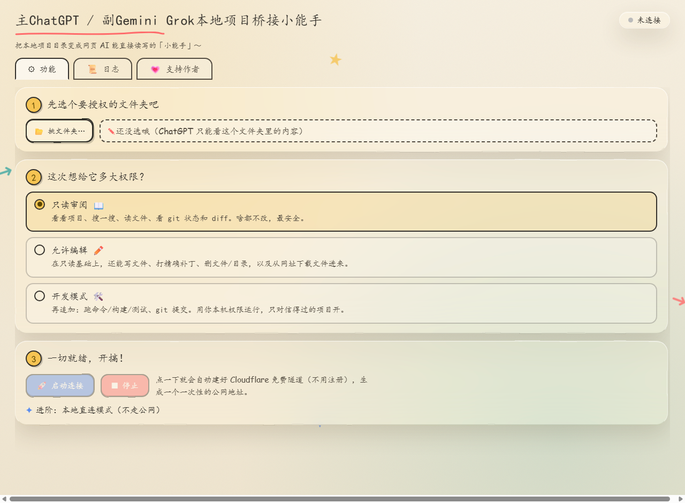
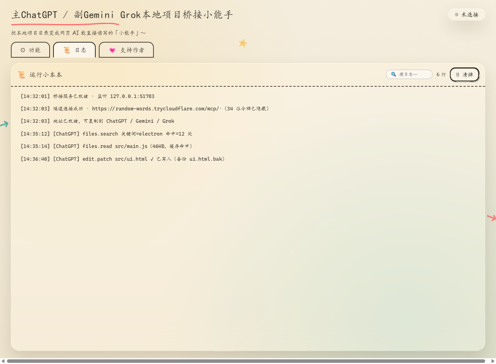

# Local Project Buddy (本地项目小能手)

**Let ChatGPT / Gemini / Grok read & write your local project folders — like a native agent**

[中文](README.md) ｜ **English**

[📥 Download](../../releases) · [🚀 Quick Start](#-quick-start) · [🔒 Security](#-security--privacy) · [📖 Docs](#-documentation)

> **Note:** The application UI and full documentation are in Chinese. This English page is a summary so you know what you're downloading. The tool works regardless of your language — you only need to paste one URL into your AI's connector settings.

---

## 💡 What is this

When you chat with ChatGPT / Gemini / Grok in the browser, they **cannot see files on your computer** — you end up copy-pasting code back and forth.

**Local Project Buddy** is the bridge in between:

> You talk to the AI in the browser → the AI directly reaches into a folder **you** choose: reading files, searching code, patching files, running commands → results come back into the chat.
> Everything runs **on your own PC**. No files are uploaded to any third-party server.

Close the app and the connection is gone — the AI loses access immediately.

## ✨ Highlights

- 🚀 **Zero-config start** — pick a folder, pick a permission level, click start; get a public URL in ~10 seconds. No account, no signup.
- 🛡️ **3 permission tiers** — Read-only / Edit / Dev mode. You decide how much power the AI gets; locked at start-up.
- 🌍 **Works with 3 platforms** — same URL works for ChatGPT, Gemini and Grok custom connectors.
- 🧰 **Complete toolset** — 10+ MCP tools: project map, file read/write, full-text search (ripgrep), precise patching, background commands, git status/diff.
- 📦 **Portable** — unzip and run. No installer, no registry writes.
- 🔒 **Layered security** — path sandbox, per-session token auth, SSRF protection, log redaction, tamper self-check. Details below.
- 📜 **Fully transparent** — a live log shows every single tool call the AI makes.

## 🖼️ Screenshots

| Main UI (3-step start) | Live log (full transparency) |
|:---:|:---:|
|  |  |

## 🚀 Quick Start

1. **Download** the latest zip from the [Releases](../../releases) page and unzip it anywhere.
2. **Launch** `本地项目小能手.exe` (the app exe — the name means "Local Project Buddy"). Choose the folder you want to expose (pick a specific project sub-folder, not your whole disk), pick a permission tier (Read-only recommended for the first run), click **Start**, then copy the URL shown.
3. **Connect your AI** — paste the full URL:
   - **ChatGPT**: Settings → enable Developer mode → Plugins → New plugin → paste URL as server URL → allow actions. [Detailed steps (Chinese)](docs/对接-ChatGPT.md)
   - **Gemini**: Settings → Apps → custom app for Spark → paste URL. [Detailed steps (Chinese)](docs/对接-Gemini.md)
   - **Grok**: Skills & Connectors → New connector → Custom → paste URL. [Detailed steps (Chinese)](docs/对接-Grok.md)
4. In a new chat, `@`-mention the connector you created and just talk naturally.

## 🔒 Security & Privacy

**"Is there a backdoor?"** — here's what's built in, and how you can verify:

- **Path sandbox**: the AI can only touch the folder you selected. Traversal and symlink escapes are rejected.
- **URL = key**: the public URL ends with a 34-character random token, regenerated on every start. Hit Stop and the old URL dies instantly.
- **Local execution**: files never leave your PC; the AI fetches only the text chunks it needs. Close the app = everything disconnected.
- **Command isolation**: sensitive env vars (authorization / cookies / bearer tokens) are stripped before running commands.
- **Tamper self-check**: modified program files trigger a warning at start-up.
- **No telemetry**: no accounts, no registration, no data collection.

**Verify it yourself:**

1. **Check the hash** — compare your download against the SHA-256 value on the Releases page (`Get-FileHash` on Windows / `sha256sum` on Linux).
2. **Scan it** — feel free to upload the zip to [VirusTotal](https://www.virustotal.com) (60+ engines).
3. **Watch the traffic** — the app only uses the official [Cloudflare cloudflared](https://developers.cloudflare.com/cloudflare-one/connections/connect-networks/downloads/) binary for its free quick tunnel (that's why the URL changes each run) and is built on the official [Electron](https://www.electronjs.org) framework. Monitor it with [GlassWire](https://www.glasswire.com/) or similar.

## ⚠️ Notes

- The public URL is a **key** — don't post it in groups or screenshots. Press Stop to rotate it.
- The URL **changes on every restart** — inherent to free quick tunnels, not a bug. If the AI can't connect, re-copy the URL.
- **Dev mode runs real commands** (including deletions). Only enable it for projects you trust.
- Writes and patches create `.bak` backups by default — rename back to restore.
- SmartScreen may warn about an unsigned exe: "More info → Run anyway".

## 💗 Support the author

This tool is a one-person, after-hours project by **Qingniao (青鸟)** — completely free, no ads, no data collection. If it helps you, buy the author a cup of tea via the WeChat QR below (any amount):

> **This software is free forever and has never been licensed for resale.** If you paid money for it, ask the seller for a refund.

## 📖 Documentation

- [Full usage manual (Chinese)](docs/使用说明.md)
- [Illustrated guide (Chinese, self-contained HTML)](docs/本地项目小能手-图文操作指导.html)
- Platform walkthroughs: [ChatGPT](docs/对接-ChatGPT.md) · [Gemini](docs/对接-Gemini.md) · [Grok](docs/对接-Grok.md)

## 📜 License

© 2026 Qingniao (青鸟). All rights reserved. Released as **freeware** — see [LICENSE.txt](LICENSE.txt) for the full terms (Chinese original; English summary below).

- ✅ Free for personal use · ✅ Free redistribution of the unmodified package
- ❌ Selling, paid bundling, or re-distribution with attribution removed is prohibited
- 🛡️ Analysis for security-audit purposes is allowed — we stand behind our code
- ⚖️ Provided "as is", without warranty of any kind

## 🔄 Changelog

See the [Releases](../../releases) page.

---

**If this tool helps you, consider giving the project a ⭐ Star**

