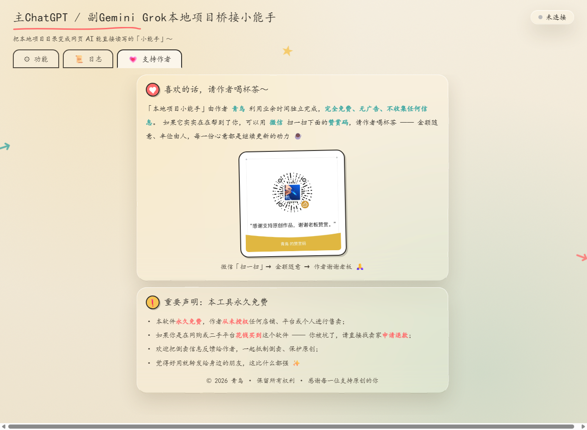

# 本地项目小能手 · Local Project Buddy

**让 ChatGPT / Gemini / Grok 像"本地助手"一样，直接读写你电脑上的项目文件夹**

-F39C12)

**简体中文** ｜ [English](README.en.md)

[📥 下载最新版](../../releases) · [🚀 快速开始](#-快速开始) · [🔒 安全说明](#-安全与隐私) · [📖 使用文档](#-文档)

---

## 💡 这是什么

你平时用 ChatGPT / Gemini / Grok 聊天时，它们**看不到你电脑里的文件**——你想让它帮忙改个本地项目的代码，只能来回复制粘贴。

**本地项目小能手**就是在你和网页 AI 之间搭的一座桥：

> 你在网页上跟 AI 说话 → AI 直接"伸手"进你指定的文件夹里**读文件、搜代码、改代码、跑命令** → 结果回到对话里。
> 所有操作都发生在**你自己的电脑上**，程序不向任何第三方服务器上传你的文件。

用完关掉程序，连接立刻断开，AI 再也碰不到你的电脑。

## ✨ 核心特性

| 特性 | 说明 |
|---|---|
| 🚀 **零配置启动** | 选文件夹 → 选权限 → 点启动，10 秒拿到公网地址，无需注册任何账号 |
| 🛡️ **三档权限可控** | 只读审阅 / 允许编辑 / 开发模式，权力给多大由你决定，启动时锁定 |
| 🌍 **三平台通用** | 同一个地址，同时对接 ChatGPT、Gemini、Grok，学会一个就会三个 |
| 🧰 **完整工具集** | 项目结构、文件读写、全文搜索、精确补丁、后台命令、git 状态等 10+ 个工具 |
| 📦 **绿色免安装** | 解压即用，不写注册表，整文件夹拷到别的电脑也能跑 |
| 🔒 **多层安全防护** | 路径围栏、令牌鉴权、SSRF 防护、日志脱敏、完整性自校验（详见下文） |
| 📥 **下载自动导入** | 浏览器下载的文件可自动导入项目 assets 文件夹 |
| 📜 **全程透明** | 日志页实时显示 AI 的每一次工具调用，看得见才放心 |

## 🖼️ 界面预览

| 主界面（三步启动） | 实时日志（全程透明） |
|:---:|:---:|
|  |  |

| 💗 支持作者 |
|:---:|
|  |

## 🚀 快速开始

### 第 1 步：下载

到 [**Releases 发布页**](../../releases) 下载最新版压缩包（如 `LocalProjectBuddy-v1.0.0-win-x64.zip`），解压到任意文件夹。

> 建议顺手校验一下文件完整性：发布页提供了 zip 的 **SHA-256 校验值**，在 PowerShell 里运行
> `Get-FileHash 文件名.zip` 比对一致，说明文件没有被篡改过。

### 第 2 步：启动（四步走）

1. 双击文件夹里的 **`本地项目小能手.exe`**；
2. 点「📁 选择文件夹」，选定要开放给 AI 的项目目录（**建议选具体的项目子目录**，别选整个 C 盘）；
3. 选权限档位（第一次用建议默认的「只读审阅」，最安全）；
4. 点「🚀 启动连接」，等几秒出现公网地址卡片，点「📋 复制整串地址」。

### 第 3 步：对接你的 AI

把复制到的**完整地址**粘贴到对应平台的配置里，三选一（也可以都配）：

| 平台 | 对接教程 |
|---|---|
| ChatGPT（网页版） | [📝 对接步骤（5 步）](docs/对接-ChatGPT.md) |
| Google Gemini（Spark） | [📝 对接步骤（3 步）](docs/对接-Gemini.md) |
| Grok | [📝 对接步骤（2 步）](docs/对接-Grok.md) |

然后开个新对话，`@` 一下你创建的插件，直接说人话就行，比如：*“先看一下项目结构，然后把 src 里的 md5 全部换成 sha256"*

## 🔒 安全与隐私

**你可能最关心的问题：这软件安全吗？会不会有后门？**

**设计层面的防护**（写进程序里的，不是口号）：

- **路径围栏**：AI 只能碰你选定的那个文件夹，目录穿越、符号链接越界会被直接拒绝；
- **地址即钥匙**：公网地址末尾带 34 位随机令牌，每次启动重新生成，点「停止」旧地址立刻失效；
- **本地执行**：文件不出你的电脑，AI 只是按需取回要看的文本片段；关闭程序 = 全部断开；
- **命令隔离**：执行命令时自动剥离 authorization / cookie / bearer 等敏感环境变量；
- **防篡改自检**：程序文件被修改过会弹窗警告（默认拒绝启动）；
- **无遥测**：不收集任何用户信息，没有账号系统，不需要注册。

**你可以亲自验证**：

1. **对哈希**：下载后用 `Get-FileHash` 比对发布页的 SHA-256，确认文件原封未动；
2. **自行查毒**：欢迎把程序上传到 [VirusTotal](https://www.virustotal.com)（全球 60+ 杀毒引擎在线扫描）复查；
3. **看行为**：程序只调用 [Cloudflare 官方 cloudflared](https://developers.cloudflare.com/cloudflare-one/connections/connect-networks/downloads/) 组件建立隧道（免费临时隧道，这正是地址每次都变的原因），基于 [Electron](https://www.electronjs.org) 官方框架构建。用 [GlassWire](https://www.glasswire.com/) 之类的流量监控工具可以看到它连了哪里。

## ⚠️ 使用注意（精选）

- **地址 = 钥匙**：公网地址含令牌，别发群里、别截图外传；怕泄露就点「停止」重启，换新钥匙；
- **地址每次都变**：免费临时隧道的固有特性，不是故障。AI 连不上时，多半是地址过期了，复制新地址重填即可；
- **开发模式要谨慎**：AI 执行的命令是真的会执行的（包括删文件），只对信得过的项目开；
- **改坏了能救**：写文件/打补丁默认留 `.bak` 备份，把 `.bak` 改回原名即可恢复；
- **杀毒误报**：未签名的绿色软件可能被 Windows SmartScreen 拦一下，点「更多信息 → 仍要运行」即可；
- **免费账号限额**：ChatGPT 免费档接入含文件工具的连接器后更容易触顶，触顶后开新对话即可（这是 OpenAI 的计量策略，与本程序无关）。

完整版：[docs/使用说明.md](docs/使用说明.md)

## ⚖️ 使用声明

下载、打开或使用本软件，即表示你已阅读、理解并同意以下条款（完整版见 [LICENSE.txt](LICENSE.txt)）：

- **自愿使用**：本软件完全免费、自愿获取。任何人下载、打开或运行本软件，即视为自愿接受本声明及许可协议的全部条款；如不同意，请停止使用并删除本软件。
- **账号风险自担**：本软件只在你自己的电脑上本地运行，并与**你指定的**网页 AI 服务交互。你在 OpenAI、Google、xAI 等第三方平台的账号属于你自己的资产——因平台政策调整、计量限制、风控、封禁或任何与账号相关的后果，均与本软件作者、本 GitHub 项目及其发布者无关，请自行评估并遵守相关平台的服务条款。
- **操作真实生效**：AI 经你授权执行的读写、修改、命令会真实作用于你的电脑。请审慎选择开放目录与权限档位，并善用程序自带的备份机制。
- **无担保**：本软件按"现状"提供，不作任何明示或默示的担保；因使用或无法使用本软件造成的任何直接、间接损失，作者不承担责任。

## 💗 支持作者

这个工具由作者 **青鸟** 利用业余时间独立完成，**完全免费、无广告、不收集任何信息**。

如果它实实在在帮到了你，可以微信扫一扫请作者喝杯茶 ☕ —— 金额随意，心意最重要：

> **⚠️ 郑重声明：本软件永久免费，从未授权任何店铺或个人售卖。**
> 如果你是花钱买到这个软件的——请直接找卖家**申请退款**。支持原创，抵制倒卖 ✨

## 📖 文档

| 文档 | 内容 |
|---|---|
| [使用说明](docs/使用说明.md) | 完整功能说明、注意事项、常见问题排查 |
| [图文操作指导](docs/本地项目小能手-图文操作指导.html) | 下载即看的图文长教程（含全部截图） |
| [对接图文指南](docs/CCP对接图文指南.html) | 三平台对接 + 实战样例 + FAQ |
| [对接 ChatGPT](docs/对接-ChatGPT.md) / [Gemini](docs/对接-Gemini.md) / [Grok](docs/对接-Grok.md) | 分平台步骤速查 |

## 📜 版权与许可

© 2026 青鸟 · 保留所有权利

本项目以**免费软件（Freeware）**形式发布，完整条款见 [LICENSE.txt](LICENSE.txt)。要点：

- ✅ 个人学习与使用：**完全免费**；
- ✅ 原样转发完整安装包给朋友：欢迎，但不得收费；
- ❌ 售卖、捆绑销售、收费分发、去除作者信息二次分发：**禁止**；
- 🛡️ 为安全审计目的的分析研究：允许（我们对自己的代码有信心）；
- ⚖️ 软件"按现状"提供，使用风险自担，详见免责条款。

## 🔄 更新日志

每个版本的更新内容见 [**Releases 发布页**](../../releases)。

---

**如果这个工具帮到了你，欢迎给项目点一个 ⭐ Star，让更多人看到它**

