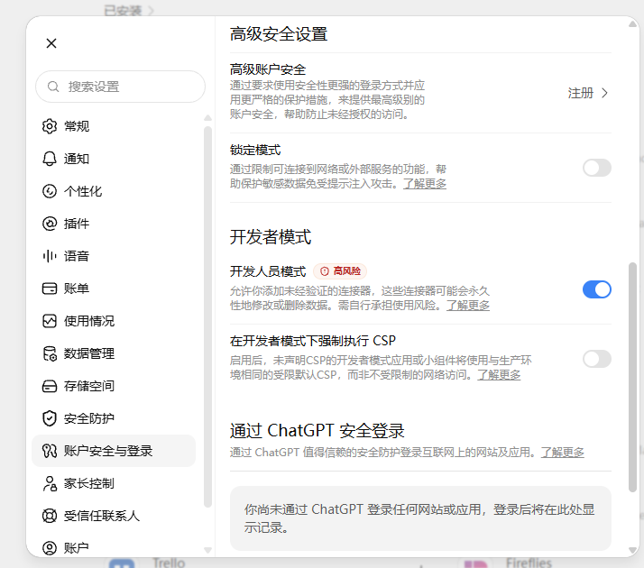
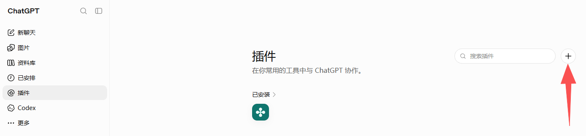
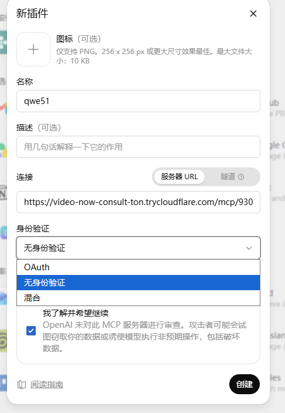
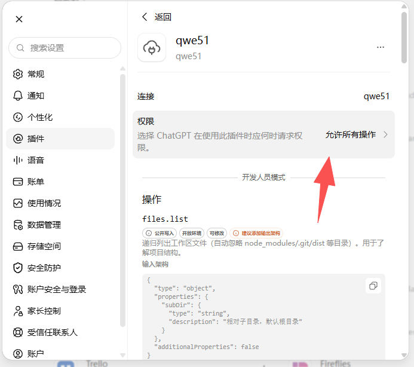
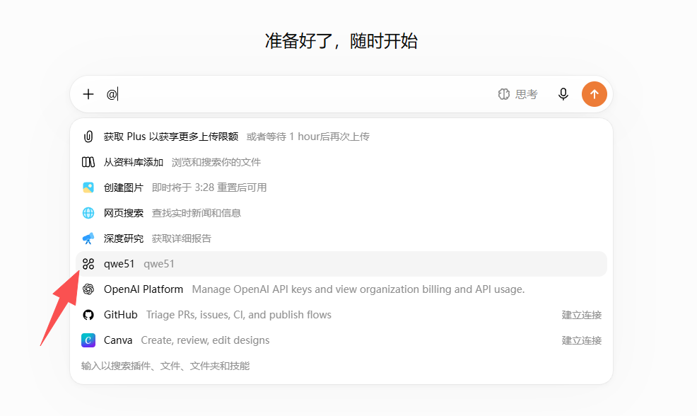

# 对接 ChatGPT（网页版）

> **前提：必须先开启「开发者模式」，否则创建插件会一直失败。**
> 前置：先启动「本地项目小能手」，复制好完整地址（整串，含 `/mcp/` 后缀）。

## 第 1 步：开启开发者模式

路径：**网页账户设置 → 账户安全与登录 → 下拉到「开发者模式」→ 打开右侧开关**

不打开这一项，后面创建插件会一直失败。这是 ChatGPT 的强制前提。

## 第 2 步：进入插件页 → 点 ➕ 新建

左侧菜单点「插件」→ 右上角「+」新建（也可直接点程序界面右侧的「打开 chatgpt.com/plugins ↗」跳转）。

## 第 3 步：填写插件信息并创建

- **名称**：随便填，自己能认出来即可
- **描述**：留空
- **连接**：选「服务器 URL」，把隧道完整地址粘进去
- **身份验证**：选「无」
- 勾选底部「我了解并希望继续」→ 点击「创建」

> 常见提示：OpenAI 会显示"未对此 MCP 服务器进行审查…"——这是固定提示，勾选"我了解"即可，与程序无关。

## 第 4 步：权限放行

创建成功后进入插件详情页，点右上角「**允许所有操作**」。

> 想更安全？可以只勾选「低风险操作」（只读类）。但日常协作建议允许所有，否则每次 AI 调用工具都会弹窗确认，体验很差。

## 第 5 步：新对话中 @ 插件 → 开始使用

新建对话 → 输入框按 `@` → 选刚创建的插件 → 正常说话即可。

@ 一次即可，同一会话里多次调用工具不需要重复 @。

## 换地址怎么办？

程序每次重启后地址会变。到插件的编辑页，把「服务器 URL」换成最新复制的那串完整地址保存即可。

---

← [返回主页](../README.md) ｜ 完整说明见 [使用说明](使用说明.md)
