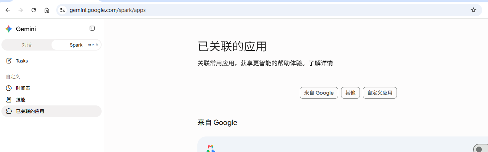
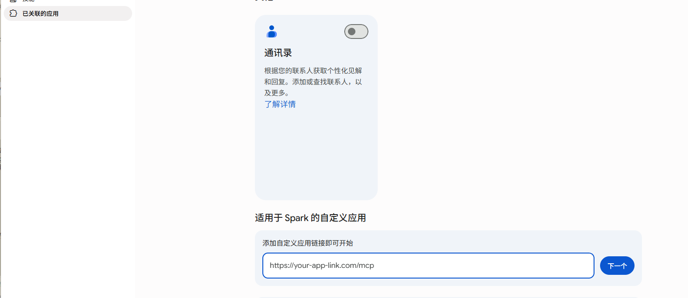
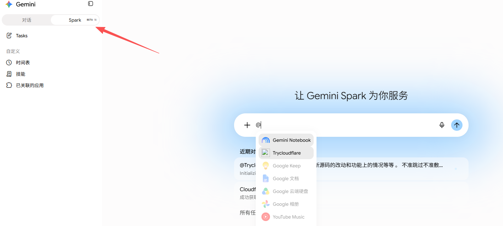

# 对接 Google Gemini（Spark）

> 前置：先启动「本地项目小能手」，复制好完整地址（整串，以 `/mcp/` 结尾）。
> Gemini 走"已关联的应用 → 自定义应用"路径，比 ChatGPT 还少一步权限放行。

## 第 1 步：进入「已关联的应用」

路径：**左下角账户设置 → 技能 → 左侧「已关联的应用」**，页面下拉找到「适用于 Spark 的自定义应用」区块（或直接点「自定义应用」按钮）。

## 第 2 步：粘贴地址 → 关联

在输入框里粘贴完整隧道地址 → 点「下一个」→ 点「下一步」→ 勾选了解 → 点「**关联**」。

## 第 3 步：在 Spark 对话里 @ 调用

**顶部切到 Spark 模式**（不是普通对话）→ 新建对话 → 输入框按 `@` → 选刚添加的应用即可。

## 换地址怎么办？

程序每次重启后地址会变。回到「已关联的应用」里编辑那个自定义应用，换成最新地址重新关联即可。

---

← [返回主页](../README.md) ｜ 完整说明见 [使用说明](使用说明.md)
