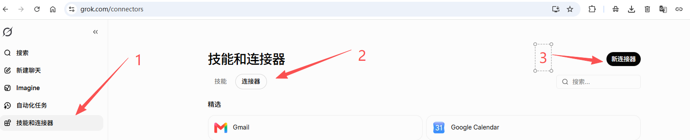
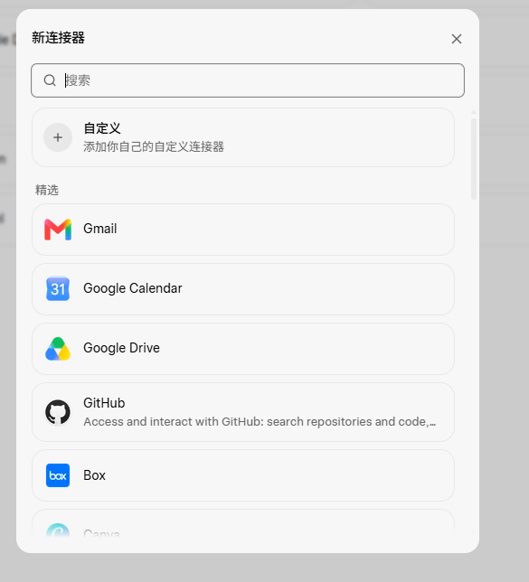

# 对接 Grok

> 前置：先启动「本地项目小能手」，复制好完整地址（整串，含 `/mcp/` 后缀）。
> Grok 三步搞定，且添加后即时生效，无需单独做权限放行。

## 第 1 步：进入连接器页

路径：**左侧「技能和连接器」→ 中上「连接器」标签 → 右上「新连接器」**。

## 第 2 步：选自定义 → 填地址

弹出层里点「**自定义**」（顶部第一项）→ 名称随便填 → 把完整隧道地址粘到「服务器 URL」→ 点「添加连接器」。

## 第 3 步：新对话 @ 调用

新建对话 → 输入框按 `@` → 选刚创建的连接器，直接开始用。

## 换地址怎么办？

程序每次重启后地址会变。到连接器管理里编辑「服务器 URL」，换成最新地址即可。

---

← [返回主页](../README.md) ｜ 完整说明见 [使用说明](使用说明.md)
